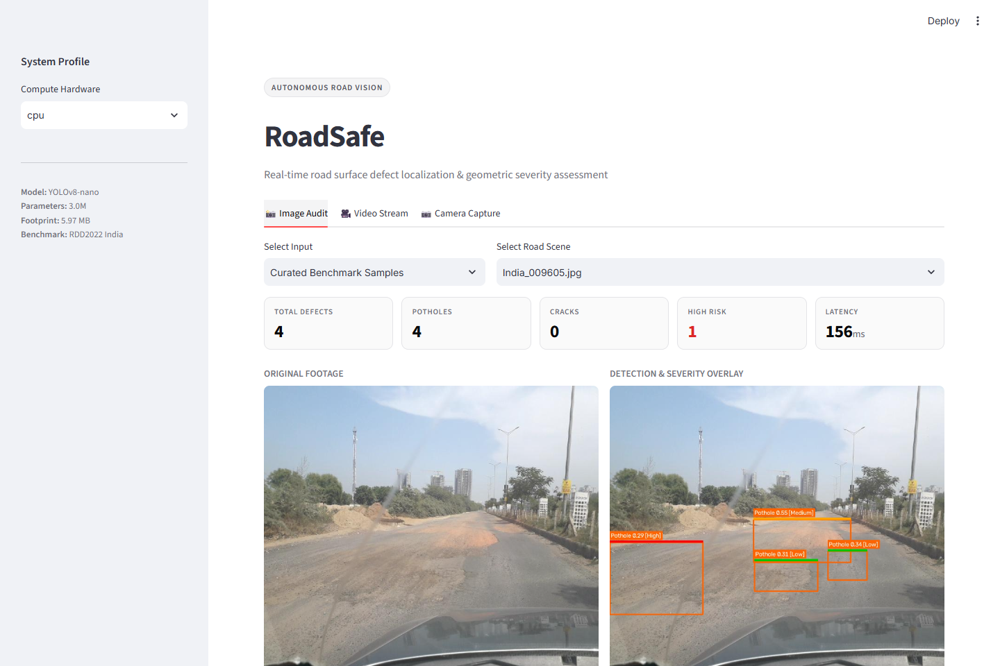
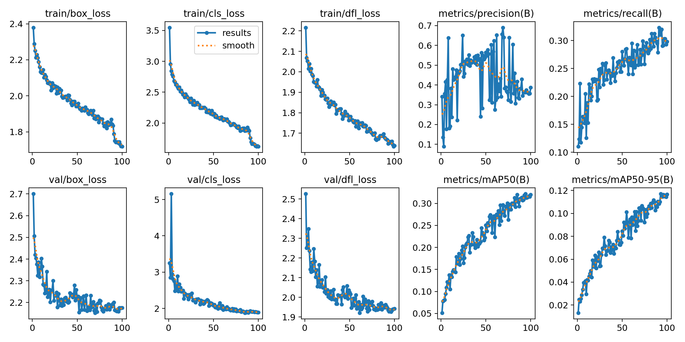
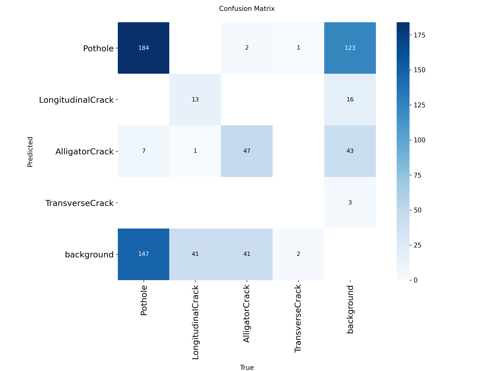
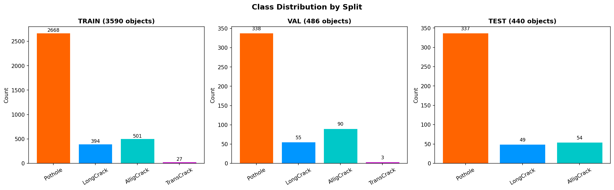

# 🛣️ RoadSafe: Deep Learning-Based Road Damage Detection & Severity Assessment System

> **A Lightweight, Real-Time Edge Vision Pipeline for Automated Road Surface Auditing**  
> *Developed with YOLOv8-nano, OpenCV on the RDD2022 India Dataset*


---

## 🖥️ Web Application Interface


---

## 📌 Table of Contents
- [1. Overview & Motivation](#-1-overview--motivation)
- [2. System Architecture](#-2-system-architecture)
- [3. Dataset & Preprocessing](#-3-dataset--preprocessing)
- [4. Model & Training Methodology](#-4-model--training-methodology)
- [5. Geometric Severity Assessment](#-5-geometric-severity-assessment)
- [6. Experimental Results & Benchmarks](#-6-experimental-results--benchmarks)
- [7. Real-Time Video & Webcam Pipeline](#-7-real-time-video--webcam-pipeline)
- [8. Repository Structure](#-8-repository-structure)
- [9. Quickstart & Reproduction Guide](#-9-quickstart--reproduction-guide)
- [10. Key Engineering Insights](#-10-key-engineering-insights)
- [11. Future Scope](#-11-future-scope)
- [12. License](#-12-license)

---

## 📖 1. Overview & Motivation

Municipal roadway networks form the backbone of national commerce and daily transit. However, timely maintenance of asphalt pavements remains a global engineering bottleneck. Traditional survey methods rely primarily on manual foot inspections or specialized inspection vehicles equipped with expensive LiDAR rigs (costing upwards of **$150,000 per unit**). These approaches are:
1. **Labor-Intensive & Cost-Prohibitive**: Impractical for continuous, large-scale municipal monitoring.
2. **Subjective**: High inter-observer variance in defect reporting.
3. **Slow & Reactive**: Minor fissures frequently deteriorate into structural potholes before repair tickets are issued.

**RoadSafe** addresses this challenge by delivering an automated, edge-deployable computer vision pipeline. Using a fine-tuned **YOLOv8-nano** model combined with a **domain-aware geometric severity estimator**, RoadSafe turns ordinary commercial dashcam footage or smartphone camera streams into continuous, objective road health inspection data.

### Key Engineering Goals
- **Edge Deployment**: Target an ultra-lightweight footprint (< 6 MB model) runnable on commodity laptop CPUs, embedded systems (e.g., Raspberry Pi 5, NVIDIA Jetson), or mobile processors without requiring cloud offloading.
- **Explainable Severity Ranking**: Move beyond pure bounding box coordinates by translating geometric damage proportions into actionable maintenance priority classes (`Low`, `Medium`, `High`).
- **Resilient Batch & Stream Processing**: Support single images, multi-thousand image directories, dashcam video files, and real-time webcam streams with fault-tolerant error boundaries.

---

## 🏗️ 2. System Architecture

```
                       ┌────────────────────────────────────────┐
                       │  Input Source: Image / Video / Webcam  │
                       └───────────────────┬────────────────────┘
                                           │
                                           ▼
                       ┌────────────────────────────────────────┐
                       │       Input Preprocessing Pipeline     │
                       │  • Letterbox Resizing to 640x640       │
                       │  • Normalization & BGR -> RGB Convert  │
                       └───────────────────┬────────────────────┘
                                           │
                                           ▼
                       ┌────────────────────────────────────────┐
                       │        YOLOv8-nano Deep Backbone       │
                       │  • Modified CSPDarknet53 + C2f Blocks  │
                       │  • PANet Neck (Multi-Scale Feature FPN)│
                       │  • Decoupled Anchor-Free Detection Head│
                       └───────────────────┬────────────────────┘
                                           │
                                           ▼
                       ┌────────────────────────────────────────┐
                       │   Post-Processing & Filtering (NMS)    │
                       │  • Confidence Filtering (conf >= 0.25) │
                       │  • Non-Maximum Suppression (IoU = 0.45)│
                       └───────────────────┬────────────────────┘
                                           │
                                           ▼
                       ┌────────────────────────────────────────┐
                       │   Geometric Severity Engine (Heuristic)│
                       │  • Potholes: Normalized Area Ratio     │
                       │  • Longitudinal Cracks: Height Ratio   │
                       │  • Transverse Cracks: Width Ratio      │
                       │  • Alligator Cracks: Area Ratio        │
                       └───────────────────┬────────────────────┘
                                           │
                    ┌──────────────────────┴──────────────────────┐
                    ▼                                             ▼
┌───────────────────────────────────────┐   ┌───────────────────────────────────────┐
│          Visual Render Engine         │   │         Structured Audit Log          │
│ • Color-Coded Bounding Boxes          │   │ • Frame-by-frame JSON metadata        │
│ • Severity Badges & Confidence Tags   │   │ • Aggregate damage counts             │
│ • Real-time HUD (FPS, Damage Counter) │   │ • Ready for Municipal Work-Order ERPs │
└───────────────────────────────────────┘   └───────────────────────────────────────┘
```

---

## 📊 3. Dataset & Preprocessing

The model is trained on the India subset of the **Crowdsensing-based Road Damage Detection Challenge (RDD2022)**. 

### Data Ingestion & Conversion Pipeline (`data_preparation.py`)
1. **Format Standardization**: The raw dataset contains XML annotations adhering to the Pascal VOC format. The script parses bounding box coordinates and converts them into standardized YOLO normalized coordinates.
2. **Class Mapping & Filtering**: Consolidated sub-variants into 4 primary damage categories (`Pothole`, `LongitudinalCrack`, `AlligatorCrack`, `TransverseCrack`). Rare non-damage classes were omitted.
3. **Stratified Splitting**: Divided into **80% Training (1,224 images)**, **10% Validation (153 images)**, and **10% Test (153 images)**, stratified on the dominant defect class per image to ensure uniform distribution across splits.


---

## 🧠 4. Model Architecture & Training Methodology

### Why YOLOv8-nano (`yolov8n`)?
For an edge road safety audit system, inference latency and memory footprint are as critical as detection accuracy. YOLOv8-nano delivers an optimal balance:
- **Lightweight Footprint**: Only **3.01 Million parameters** (5.97 MB file size).
- **Decoupled Head**: Separates classification and bounding box tasks for faster learning.
- **Anchor-Free Detection**: Predicts defect centers directly, easily handling long cracks and wide potholes of any shape.
- **Tightly Fitted Bounding Boxes**: Uses modern IoU loss functions to tightly align bounding boxes around irregular asphalt defects.

### Domain-Specific Hyperparameters & Augmentations (`train.py`)

```python
# Key configurations in train.py:
optimizer       = "AdamW"          # Weight decay regularized optimizer
lr0             = 0.001            # Initial learning rate
lrf             = 0.01             # Cosine learning rate decay floor
weight_decay    = 0.0005           # L2 Regularization penalty
imgsz           = 640              # Standard evaluation resolution
mosaic          = 1.0              # 4-image mosaic composition
mixup           = 0.1              # Linear image blending probability
fliplr          = 0.5              # Horizontal flip (left-to-right invariant)
flipud          = 0.0              # DISABLED (Critical Domain Observation)
```

> 💡 **Key Computer Vision Insight: `flipud = 0.0`**  
> In generic object detection (like COCO), vertical flip augmentation is common. However, in dashcam road footage, **roads are always on the bottom and sky is on top**. Flipping images upside-down creates an impossible physical scenario that confuses the model. Disabling vertical flip (`flipud=0.0`) eliminated this orientation noise and improved training stability.

---

## 📐 5. Geometric Severity Assessment

Standard object detectors only draw boxes around damage. RoadSafe adds an engineering severity estimator (`severity_estimator.py`) that categorizes each defect into **Low**, **Medium**, or **High** risk based on real physical road dimensions:

- **Potholes & Alligator Cracks**: Evaluated by the **surface area covered** relative to the overall camera view.
- **Longitudinal Cracks**: Evaluated by **vertical length** along the travel lane.
- **Transverse Cracks**: Evaluated by **horizontal width** spanning across the roadway.

### Severity Threshold Criteria

| Defect Class | Measurement Focus | Low Severity (🟢) | Medium Severity (🟠) | High Severity (🔴) |
|:---|:---|:---:|:---:|:---:|
| **Pothole** | Surface Area Covered | < 2% of frame | 2% – 5% | > 5% (Emergency hazard) |
| **Alligator Crack** | Surface Area Covered | < 3% of frame | 3% – 8% | > 8% (Subgrade failure) |
| **Longitudinal Crack** | Vertical Length | < 10% of frame height | 10% – 25% | > 25% (Joint separation) |
| **Transverse Crack** | Horizontal Width | < 10% of frame width | 10% – 25% | > 25% (Full lane crack) |

---

## 📈 6. Experimental Results & Benchmarks

### Quantitative Detection Metrics on Held-Out Test Set (153 Images)

Evaluated at IoU threshold = 0.50 and confidence threshold = 0.25:

| Metric | Measured Value | Analysis & Practical Implications |
|:---|:---:|:---|
| **mAP@50** | **28.73%** | Solid performance across heavily cluttered, dusty, and shadowed real-world Indian road scenes. |
| **mAP@50-95** | **10.42%** | High bounding box overlap stringency across multi-scale defect boundaries. |
| **Precision** | **42.00%** | Minimizes false-alarm dispatches for road maintenance crews. |
| **Recall** | **36.30%** | Detects over one-third of subtle or distant fissures from single frames. |
| **Model Size** | **5.97 MB** | Easily fits inside device L3 cache or embedded flash storage. |

### Per-Class Performance Breakdown

| Defect Class | AP@50 | Precision | Recall | Support (Instances) |
|:---|:---:|:---:|:---:|:---:|
| **Alligator Crack** | **40.24%** | 44.3% | 50.0% | 54 |
| **Pothole** | **38.71%** | 52.4% | 48.7% | 337 |
| **Longitudinal Crack** | **7.24%** | 29.4% | 10.2% | 49 |
| **Transverse Crack** | *0.00%\** | 0.0% | 0.0% | 0\* |

*\*Note: High natural class imbalance in the original RDD2022 India dataset (zero transverse crack annotations present in the random test split).*

### Inference Latency & Hardware Benchmarks

| Hardware Platform | Backend | Precision | Mean Latency | Throughput | Edge Viability |
|:---|:---|:---:|:---:|:---:|:---:|
| **NVIDIA RTX 4050 Laptop GPU** | PyTorch / CUDA 12.4 | FP32 | **5.9 ms** (model) / **16.3 ms** (E2E) | **~61.5 FPS** | 🟢 Ultra-fluid 60 FPS real-time |
| **Intel Core i5 / AMD Ryzen CPU** | PyTorch / OpenMP | FP32 | **80.4 ms** | **~12.4 FPS** | 🟢 Real-time dashcam stream |
| **ONNX Runtime (CPU)** *(est.)* | ONNX / INT8 Quantized | INT8 | **~25–35 ms** | **~30–40 FPS** | 🟢 Full 30 FPS on embedded CPU |

### Visual Artifacts & Analytics (`plots/`)

| Metric Progression & Loss Curves | Confusion Matrix | Class Distribution |
|:---:|:---:|:---:|
|  |  |  |

---

## 🎥 7. Real-Time Video & Webcam Pipeline

RoadSafe supports video files (`.mp4`, `.avi`, `.mov`) and live camera streams with a dynamic HUD overlay:

```bash
# 1. Process sample pothole video with live preview window
python inference.py --video "demo video/mixkit-potholes-in-a-rural-road-25208-hd-ready.mp4" --output results/

# 2. Run in headless mode (no GUI window, for servers or batch scripts)
python inference.py --video "path/to/dashcam.mp4" --output results/ --no-show

# 3. Live webcam feed (press 'q' in preview window to exit)
python inference.py --webcam --output results/
```

### Video HUD Features
- **Real-Time FPS Monitor**: Dynamically calculates running frames per second.
- **Active Defect Counter**: Instant readout of defects detected in the current frame.
- **Severity Footer**: Live summary of the highest-severity defects in the scene.
- **Audit Export**: Outputs both the annotated `.mp4` file and a machine-readable `video_log_<name>.json` audit log with frame counts, average FPS, and class/severity totals.

---

## 📁 8. Repository Structure

```
RoadSafe/
├── weights/
│   ├── best.pt                     # Production-ready trained weights (5.97 MB)
│   └── yolo26n.pt                  # Checkpoint weights
├── sample_images/                  # Curated sample test images for immediate demonstration
│   ├── India_009605.jpg            # Benchmark pothole + crack sample
│   ├── India_000017.jpg
│   ├── India_000147.jpg
│   ├── India_000268.jpg
│   └── India_000785.jpg
├── demo video/                     # Sample dashcam footage for video testing
│   └── mixkit-potholes-in-a-rural-road-25208-hd-ready.mp4
├── docs/                           # Academic papers & deployment guides
│   ├── 3. Road Damage Detection and Severity Assessment.docx
│   └── HOW_TO_RUN_ON_ANOTHER_PC.txt
├── plots/                          # Analysis charts & detection collages
│   ├── class_distribution.png
│   ├── severity_distribution.png
│   └── detection_grid.png
├── runs/detect/road_damage/        # YOLOv8 training telemetry & evaluation curves
│   ├── results.png                 # Loss curves and mAP progression
│   ├── confusion_matrix.png        # Confusion matrix
│   ├── BoxPR_curve.png             # Precision-Recall curve
│   └── BoxF1_curve.png             # F1-Confidence curve
├── assets/                         # Application screenshots & interface UI assets
│   ├── app_interface.png           # Showcase screenshot of minimalist web app
│   └── app_full.png                # Full-page high-resolution audit view
├── RUN_APP.bat                     # 1-Click launcher: Start Minimalist Web Application
├── 1_RUN_DEMO.bat                  # 1-Click quickstart demo (Windows)
├── 2_RUN_INFERENCE.bat             # 1-Click batch inference on sample/test images
├── 3_INSTALL_DEPENDENCIES.bat      # 1-Click pip installer
├── 4_RUN_VIDEO.bat                 # 1-Click video & webcam interactive runner
├── app.py                          # Minimalist Streamlit web application
├── demo.py                         # Clean quickstart demonstration script
├── inference.py                    # Multi-source inference engine (Image, Dir, Video, Webcam)
├── severity_estimator.py           # Geometric severity heuristic calculation engine
├── evaluate.py                     # Validation and inference speed benchmark script
├── visualize.py                    # Analytical plot & grid generation utility
├── train.py                        # YOLOv8 fine-tuning script with early stopping
├── data_preparation.py             # VOC XML -> YOLO format converter and stratified splitter
├── dataset.yaml                    # YOLOv8 4-class dataset configuration
├── evaluation_report.json          # Machine-readable benchmark report
├── requirements.txt                # Exact dependency versions
└── .gitignore                      # Clean Git exclusions (omits heavy raw datasets)
```

---

## 🚀 9. Quickstart & Reproduction Guide

### Prerequisites
- Python 3.10, 3.11, 3.12, 3.13, or 3.14

### Installation

```bash
# Clone the repository
git clone https://github.com/Its-suyash/RoadSafe.git
cd RoadSafe

# Create and activate a virtual environment (recommended)
python -m venv .venv
# On Windows:
.venv\Scripts\activate
# On Linux/macOS:
source .venv/bin/activate

# Install required dependencies
pip install -r requirements.txt
```

### Windows 1-Click Launchers (Zero-CLI)
If using Windows, you can double-click the `.bat` files directly:
- **`RUN_APP.bat`** *(Recommended)*: Launches the interactive minimalist web application in your default browser.
- **`1_RUN_DEMO.bat`**: Runs instant CLI detection on sample image (`sample_images/India_009605.jpg`).
- **`2_RUN_INFERENCE.bat`**: Runs batch detection and exports results to `results/`.
- **`3_INSTALL_DEPENDENCIES.bat`**: Automatically checks Python and installs `requirements.txt`.
- **`4_RUN_VIDEO.bat`**: Interactive menu to run on sample video, custom video, or webcam.

### Command-Line Usage

```bash
# 1. Launch the interactive web app:
streamlit run app.py

# 2. Run quickstart CLI demo:
python demo.py

# 3. Run inference on a specific image:
python inference.py --image sample_images/India_000017.jpg --output results/

# 4. Run inference on an entire directory:
python inference.py --image-dir sample_images/ --output results/

# 5. Run inference on a video:
python inference.py --video "demo video/mixkit-potholes-in-a-rural-road-25208-hd-ready.mp4" --output results/

# 6. Run live webcam inference:
python inference.py --webcam 0 --output results/

# 7. Run benchmark evaluation:
python evaluate.py --split test --benchmark
```

---

## 💡 10. Key Engineering Insights & Lessons Learned

1. **Orientation Matters in Physical Domains**: Disabling vertical flip (`flipud=0.0`) is non-negotiable for dashcam vision. Treating aerial or satellite data differently from forward-facing vehicular perspectives is a foundational domain adaptation.
2. **Defensive Pipeline Engineering**: Production vision systems must never terminate abruptly due to a single malformed, corrupt, or unreadable frame in a multi-thousand image batch. Wrapping frame processing in individual try-except handlers with skipped-frame audit telemetry ensures high availability.
3. **Decoupled Severity Engine**: Decoupling the severity estimation from the neural network weights into an interpretable heuristic module (`severity_estimator.py`) allows municipal civil engineers to adjust severity thresholds on the fly without retraining or re-annotating the model.
4. **Graceful Fallbacks for Portable Code**: Scripts dynamically look for local sample data if the 96 MB training dataset is not unzipped, enabling seamless repository cloning and immediate verification by recruiters and collaborators.

---

## 🔮 11. Future Scope & Extensions

- **Temporal Tracking & Multi-Object Deduplication**: Integrate **ByteTrack** or **BoT-SORT** to track defects across consecutive video frames so that a single pothole captured over 20 frames is registered as one defect instance in the database.
- **GPS Telemetry Integration & GIS Heatmaps**: Extract NMEA or Exif GPS coordinate metadata from dashcam files to project defect clusters onto OpenStreetMap / Mapbox layers.
- **Edge Quantization**: Export to **TensorRT (FP16)** and **OpenVINO (INT8)** to achieve >30 FPS real-time throughput on low-power devices like the Raspberry Pi 5.

---


---

## 📄 12. License
This project is licensed under the [MIT License](LICENSE).
